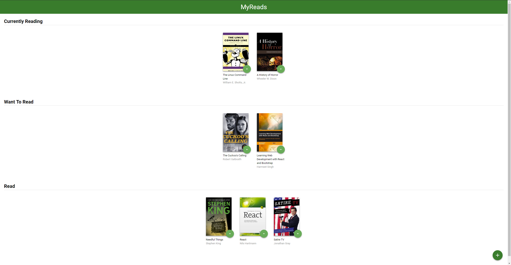

# MyReads Project

## Table of content 

- Objective
- How to Load the App
- How to Use the App 
- Resources and Documentation
- Udacity Resources

## MyReads objective

This app is a project from Udacity Front-End-Web Nano Degree. This app is composed of three different categories for books and you could change a book's status and even add a new book.  

## How to Load the App

1. Open the terminal.
2. Check your node version by running `node --version`. If you do not have Node >= 6.x installed, you can download it here: [Node.js](https://nodejs.org/en/)
3. Once its installed navigate to the directory you want to clone the app to.
4. Clone the repository or download it as a zip.
5. Navigate to the repository's root in the terminal and run `npm install`.
6. Once the download is done you should run `npm run start` and another window in the brower will open which contains the App, and if it doesnt you could navigate to [http://localhost:3000/](http://localhost:3000/) in your browser.

## How to Use the App

- Books are sorted into three categories: Currently Reading, Want to Read and Read
- To change a book's category or remove a book from the list, click on the green button on the book cover

### Resources and Documentation:

- [Create-react-app Documentation](https://github.com/facebookincubator/create-react-app)
- [React Router Documentation](http://knowbody.github.io/react-router-docs/)
- [React Training/React Router](https://reacttraining.com/react-router/web/api/BrowserRouter)
- [React API](https://facebook.github.io/react/docs/react-api.html)

### Udacity Resources:

- [Project starter template](https://github.com/udacity/reactnd-project-myreads-starter)
- [Project Rubric](https://review.udacity.com/#!/rubrics/918/view)
- [Udacity CSS Style Guide](http://udacity.github.io/frontend-nanodegree-styleguide/css.html)
- [Udacity HTML Style Guide](http://udacity.github.io/frontend-nanodegree-styleguide/index.html)
- [Udacity JavaScript Style Guide](http://udacity.github.io/frontend-nanodegree-styleguide/javascript.html)